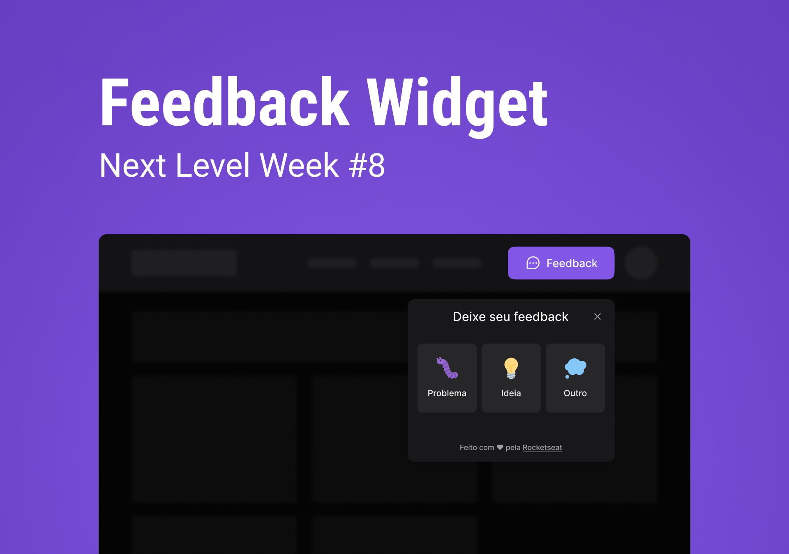

# Next Level Week - Feedback Widget 
Projeto desenvolvido durante a NLW Return da [Rocketseat](https://www.rocketseat.com.br/)




### Back-End Architecture 


### CI/CD Pipeline


## 🧪 Tecnologias utilizadas / Used Technologies
 
#### Frontend:
- [Vercel](https://vercel.com)
- [Typescript](https://www.typescriptlang.org/)
- [ReactJS](https://reactjs.org/)
- [TailwindCSS](https://tailwindcss.com/)
- [HeadlessUI](https://headlessui.dev/)

## Backend:
- [Railway](https://railway.app/)
- [Typescript](https://www.typescriptlang.org/)
- [Prisma](https://www.prisma.io/)
- [Express](https://expressjs.com/)
- [Node.js](https://nodejs.org/en/)
- [PostgreSQL](https://www.postgresql.org/)
- [Jest](https://jestjs.io/)

## Mobile
- [Expo](https://expo.dev/)
- [Axios](https://axios-http.com/docs/intro)

----------------------------------------------------------------------------------------------------------

## 🚀 Como rodar o projeto / Running the project**

Clone o projeto e acesso o diretório.

```bash
$ git clone https://github.com/henriquelvieira/NLW-Return.git
$ cd NLW-Return
```

- Front-end na pasta ( Run the frontend on the folder ) `/web` com ( with ) 

```
npm install
npm run dev
```

- Back-end na pasta ( Run the backend on the folder ) `/server` com ( with ) 

```
npm install
npm run dev
```

- Mobile na pasta ( Run the mobile on the folder ) `/mobile` com ( with ) 

```
npm install
expo start
```

----------------------------------------------------------------------------------------------------------

💻 **Autor / Author**

**Henrique Lopes Vieira**

LinkedIn: https://www.linkedin.com/in/henriquelvieira/ <br/>
E-mail: henrique.l.vieira92@gmail.com
